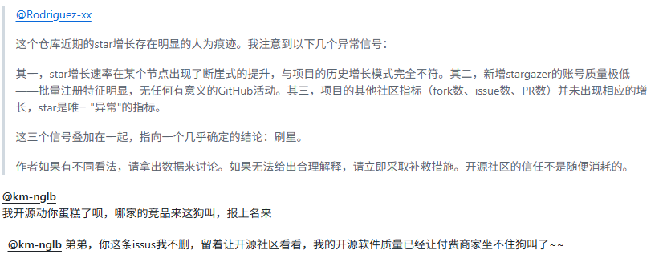
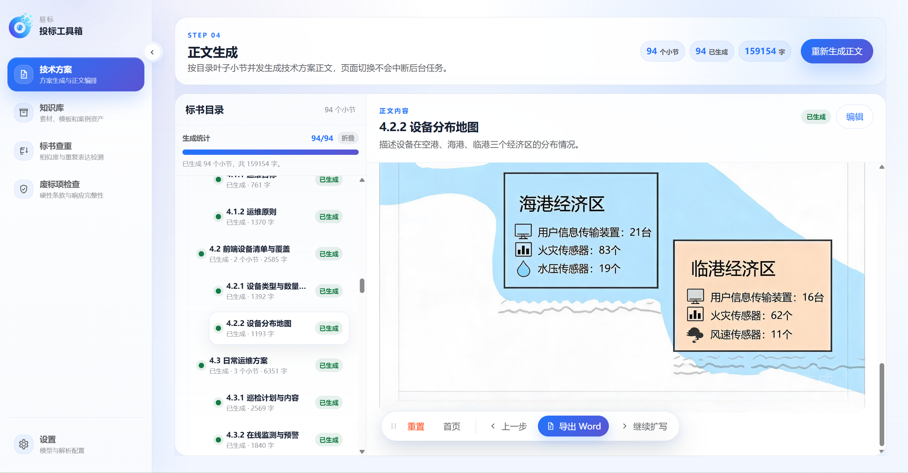

# 易标投标工具箱 - AI智能标书写作助手

<p align="center">
  <strong>简体中文</strong> | <a href="./README.en.md">English</a>
</p>

<p align="center">
  
  
  
  
  <a href="https://deepwiki.com/FB208/OpenBidKit_Yibiao"></a>
  <a href="https://linux.do/" rel="nofollow">
  
  </a>
</p>


<p align="left">
  <strong>🚀 开箱即用-开源免费AI标书编写工具</strong>
  <br>
  易标投标工具箱是一款面向招投标场景的智能标书制作工具，完全开源，包括AI生成技术方案、图文生成、商务标、企业知识库管理、标书查重、废标项检查、标讯等，更多功能还在开发中。
  <br>
  支持OpenAI like模式的所有AI api，目前已深度适配DeepSeek、龙猫、火山方舟三个平台，也支持ollama、lm studio等接入本地模型。
  <br>
  <br>
  <strong>❓ 解决什么问题</strong>
  <br>
  现在AI写标书的付费工具非常多，但是价格都超级高，一份标书几十块，除非企业给报销，小企业的牛马根本用不起。免费的工具质量又非常差，OpenBidkit力争做投标领域的OpenClaw，提供开箱即用的优质标书编写工具，亲测一份20万字的投标标书，用deepseek v4 flash 生成只需要0.8-1元，还努力适配了完全免费的LongCat-2.0-Preview，从此牛马不用自己买草料了。
</p>


## 🌐 官方网站

**在线体验**: [https://yibiao.pro](https://yibiao.pro)

获取更多产品信息、在线体验和技术支持。

> **广告位 · Jlaude API**
>
> 专注 GPT 全系列，比 DeepSeek V4 PRO更低成本，7 个月稳定高速！演武场原生对话 + 无限画布生图，一站配齐，好用不贵。
>
> 链接直达：https://jlaudeapi.com

## 📢 声明
近期收到大量issue攻击，对本仓库进行无理由诋毁和攻击，特此声明：

1. 我不会停止开源，永不！
2. 即使以后商业化，也会效仿Excalidraw、NocoDB这样优秀的开源项目，仅针对项目管理、云端存储、团队协作、企业服务等B端业务进行收费。我用人格担保，个人使用基础功能永久开源免费，且生成质量向付费软件看齐。  



## 🍉 鸣谢
- 感谢所有用户的支持与信任
- 特别鸣谢 <a href="https://linux.do/" rel="nofollow">linuxdo</a> 佬友们的支持与鼓励

<h2 align="center">✨ 核心功能与优势</h2>

<p align="center">
  <strong>AI写标书 · 标书AI · AI标书生成 · 技术标编写 · 投标文件生成</strong><br>
  <sub>不止生成标书初稿，更强调开源可控、本地工作区、素材复用、图文表达和流程可恢复。</sub>
</p>

<table>
  <tr>
    <td width="33%" valign="top">
      <strong>🧩 开源可控</strong><br>
      开源 AI标书 项目，可自行部署、二次开发和适配团队流程。
    </td>
    <td width="33%" valign="top">
      <strong>💻 本地桌面工作区</strong><br>
      配置、缓存和生成结果保存在本机，适合 Windows 标书文件处理。
    </td>
    <td width="33%" valign="top">
      <strong>📄 多方式文档解析</strong><br>
      支持本地解析与 MinerU 解析配置，兼顾常规文档和复杂文件。
    </td>
  </tr>
  <tr>
    <td width="33%" valign="top">
      <strong>📚 知识库复用</strong><br>
      沉淀企业资料、历史案例和方案素材，让标书AI更贴合业务。
    </td>
    <td width="33%" valign="top">
      <strong>🧩 图文与图表</strong><br>
      支持 Mermaid 预览、正文配图和图表转 Word，增强方案表达。
    </td>
    <td width="33%" valign="top">
      <strong>🔄 后台任务恢复</strong><br>
      解析、生成等耗时任务持续落盘，切换页面后仍可恢复进度。
    </td>
  </tr>
  <tr>
    <td width="33%" valign="top">
      <strong>🛡️ 风险检查入口</strong><br>
      预留标书查重、废标项检查工作区，聚焦重复表达和响应完整性。
    </td>
    <td width="33%" valign="top">
      <strong>⚙️ 自定义AI配置</strong><br>
      支持文本模型、生图模型和文件解析方式配置，适配团队习惯。
    </td>
    <td width="33%" valign="top">
      <strong>✏️ 可编辑工作流</strong><br>
      目录、正文和扩写结果可持续调整，方便 AI写标书 后人工定稿。
    </td>
  </tr>
</table>


## 📦 下载与使用

### ⬇️ 下载方式

从 [GitHub Releases](https://github.com/yibiaoai/yibiao-simple/releases) 下载最新版本，运行安装包或可执行文件即可启动。

### 🎬 使用方式

<a href="https://www.bilibili.com/video/BV1sC5i6SE74">
  
</a>

[点击前往 Bilibili 观看使用演示视频](https://www.bilibili.com/video/BV1sC5i6SE74)

## 🛠️ 技术架构

当前产品主体是 `client/` 下的独立桌面客户端，不依赖旧 `frontend/`、`backend/` 结构。

- **桌面端**：Electron Main / Preload 提供本地文件、配置、导出和后台任务能力
- **界面层**：Vite + React + TypeScript，使用全局 CSS 和 Radix UI 基础组件
- **业务模块**：技术方案、知识库、标书查重、废标项检查、设置页
- **本地数据**：配置、工作区、生成缓存保存在 Electron `userData` 目录
- **打包发布**：使用 electron-builder 构建 Windows / macOS 客户端

### 🏗️ 项目结构

```
易标投标工具箱/
├── client/                    # 当前桌面客户端主体
│   ├── electron/              # Main、Preload、IPC、本地服务
│   ├── src/                   # Renderer 应用源码
│   │   ├── app/               # 路由、菜单、Provider
│   │   ├── features/          # 技术方案、知识库等业务模块
│   │   └── shared/            # 通用类型、AI、UI、工具函数
│   ├── assets/                # 图标与静态资源
│   └── package.json           # 客户端依赖和打包配置
├── analytics/                 # 独立埋点服务
├── tools/                     # 独立文档解析与 MinerU 验证工具
└── README.md                  # 项目文档
```

## 🤝 贡献指南

欢迎各种形式的贡献！

1. **🐛 问题反馈**: 在 [Issues](https://github.com/yibiaoai/yibiao-simple/issues) 中报告bug
2. **💡 功能建议**: 提出新功能需求和改进建议  
3. **🔧 代码贡献**: Fork项目，提交Pull Request
4. **📖 文档完善**: 帮助改进文档和使用说明


## 📄 许可证

本项目基于 [GNU Affero General Public License v3.0](LICENSE) 开源协议发布。

你可以自由使用、修改、分发和商用本项目，但修改版、分发版和通过网络提供服务的版本必须遵守 AGPL-3.0 的开源义务，并保留本项目的 [NOTICE](NOTICE) 归属声明、原始仓库链接和作者信息。

## 🙋‍♂️ 联系我们

<table>
  <tr>
    <td width="50%" valign="top">

- **官方网站**: [https://yibiao.pro](https://yibiao.pro)
- **问题反馈**: [GitHub Issues](https://github.com/yibiaoai/yibiao-simple/issues)
- **邮箱联系**: support@yibiao.pro

    </td>
    <td width="33%" valign="top">
      <p>
        
      </p>
    </td>
  </tr>
</table>


## Star History

<a href="https://www.star-history.com/?repos=FB208%2FOpenBidKit_Yibiao&type=timeline&legend=top-left">
 <picture>
   <source media="(prefers-color-scheme: dark)" srcset="https://api.star-history.com/chart?repos=FB208/OpenBidKit_Yibiao&type=timeline&theme=dark&legend=top-left" />
   <source media="(prefers-color-scheme: light)" srcset="https://api.star-history.com/chart?repos=FB208/OpenBidKit_Yibiao&type=timeline&legend=top-left" />
   
 </picture>
</a>

---

<p align="center">
  ⭐ 如果这个项目对您有帮助，请给我们一个Star支持！
</p>


<p align="center">
  ⭐ 本项目已在 LINUX DO 社区进行开源自荐与交流，欢迎佬友监督、反馈和贡献。
</p>

`AI写标书` `标书AI` `AI标书生成` `免费标书工具`