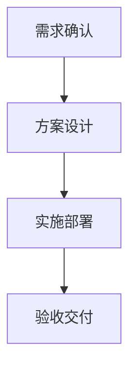

分享我开发AI标书智能体遇到的问题及全部解决方案~

在vibe coding时代，越来越觉得代码不重要了。整个标书智能体开发过程中，几乎没有遇到任何代码卡点，唯一稍复杂的是传入文件的解析，在AI的帮助下也轻松解决。

所以，以后的分享内容中不再涉及代码，只分享我遇到的问题及解决问题的思路（提示词、工作流、智能体），让大家能更好的**理解AI到底能做哪些事，以及我们如何运用好AI。**

**需要源码的到GitHub查看：**

GitHub： https://github.com/FB208/OpenBidKit_Yibiao

Gitee： https://gitee.com/yibiao-ai/OpenBidKit_Yibiao

# 先来说问题

之前一期我们已经讲过如何生成几十万甚至上百万字的标书，并保证生成结果的上下文连贯性。

但是github上有朋友善意的提醒我，没有图文附件，不能算标书：


于是我马上安排了mermaid图片生成+火山方舟（doubao-seedream-5.0）+GoogleAIStudio（nano banana pro）三种配图方式。

但是，在100万字的标书中，何时配图？配在哪里？配什么图？值得仔细思考：

- 首先要知道，我们生成正文是按照目录树叶子节点来生成的，如果给每个叶子节点都配图会面临两个问题

  - 成本太高

  - 有些章节并不适合配图

- 完全交给AI判断是否配图
  - 依赖目录判断，生成的图片可能和正文没关系
  - 依赖正文判断，又要让AI多读一遍生成结果，浪费token
  - 生图数量无法控制，导致成本无法预估
- 控制生图数量
  - 设置一个生图上限，AI按顺序生成，可能导致头重脚轻（前面配图很多，到后面没有图片额度了）

# 预编排阶段，解决正文生成所有问题

为了解决上述问题，我设计了一套预编排流程，在拿到目录后，先对全文目录进行编排，分配每个子节点是否需要生成图片，并给出分数。最后由程序遍历编排结果，选出分数最高的几个节点，标记为需要生图。

这里有一个很重要的点：**配图不是正文写完后再临时想起来加，而是在正文生成前就先规划好。**

- 这个小节要不要用知识库素材
- 这个小节适不适合用表格
- 这个小节适不适合用 Mermaid 图
- 这个小节适不适合 AI 生图
- 如果适合，优先级是多少

这样做的好处非常明显：

- 不用等正文全部生成完，再让AI重新读一遍几十万字内容
- 配图数量可以提前控制，成本可预估
- 图片不会全部集中在前几章，也不会后面章节完全没有图
- 正文生成时也知道本小节后面可能会配图，能提前和图片内容形成呼应，整体表达更稳

我的实现里，正文生成任务大概分成四步：

1. 收集所有叶子节点
2. 对所有叶子节点做正文编排
3. 根据编排结果并发生成正文
4. 正文生成完成后，再执行配图


## 正文生成配置

用户在页面上可以先设置正文生成偏好，比如是否启用AI生图、最多生成几张图、是否启用Mermaid、表格数量倾向等。

我现在用的配置结构大概是这样：

```json
{
  "useAiImages": true,
  "maxAiImages": 6,
  "useMermaidImages": true,
  "tableRequirement": "heavy"
}
```

字段也很直白：

- `useAiImages`：是否启用AI生图
- `maxAiImages`：最多生成几张AI图片
- `useMermaidImages`：是否启用Mermaid图
- `tableRequirement`：表格需求，支持 `none`、`light`、`moderate`、`heavy`

这里我没有做什么复杂的规则，比如“标题里有流程就一定画流程图”“标题里有架构就一定生图”。这种硬编码规则看起来聪明，实际很容易翻车。

我更倾向于让AI先判断，再由程序做全局控制。

比如表格如果选择“少量”，就让AI先提名候选小节，然后程序最多选 20%；选择“适中”，最多选 40%；选择“大量”，则保持比较宽松的策略。

AI生图也一样，AI可以提名很多候选，但最终只会按 `maxAiImages` 择优执行。

## 正文编排JSON结构

每个叶子节点都会生成一个编排结果，结构大概如下：

```json
{
  "knowledge": {
    "item_ids": ["knowledge_001", "knowledge_002"]
  },
  "table": {
    "needed": true,
    "purpose": "用于归纳本小节的实施步骤、责任分工和输出成果"
  },
  "mermaid": {
    "needed": false,
    "title": "实施流程",
    "code": "flowchart TD\nA[\"需求确认\"] --> B[\"方案设计\"] --> C[\"实施部署\"]",
    "priority": 3,
    "reason": "本小节包含清晰的流程关系，适合用流程图表达"
  },
  "image": {
    "needed": true,
    "style": "engineering_diagram",
    "title": "系统部署架构",
    "prompt": "生成一张专业克制的系统部署架构示意图，体现业务系统、应用服务、数据库、运维监控和安全边界之间的关系，画面适合投标技术方案插图",
    "priority": 4,
    "reason": "本小节涉及系统部署关系，适合用工程图示增强表达"
  }
}
```

这几个字段的作用分别是：

- `knowledge.item_ids`：要引用哪些知识库素材
- `table.needed`：正文生成时要不要用表格
- `mermaid.needed`：是否适合生成Mermaid图
- `image.needed`：是否适合AI生图
- `priority`：推荐分数，3表示有价值，4表示推荐，5表示强推荐

注意，这里的 `needed: true` 不是说一定执行，只是说进入候选池。

真正执行时还会过一遍全局选择。

比如全文有80个小节，AI认为20个小节都适合生图，但用户只允许最多6张，那程序就会把候选小节分段，然后在每一段里选优先级最高的。这样就能避免前面章节把图片额度全部用完。

## 正文编排提示词

正文编排阶段，我没有让AI写正文，只让它做判断，所以提示词一定要克制。

**SystemPrompt**

```markdown
你是投标技术方案正文编排助手。请根据章节上下文判断本小节最适合的表达方式。

要求：
1. 只返回 JSON，不要输出解释、总结或 Markdown。
2. 由你自行判断是否适合使用表格或配图，判断要克制、合情合理，不要为了形式而硬插。
3. 表格仅在能明显提升表达清晰度时使用，例如归纳职责、步骤、参数、风险、措施、成果等。
4. Mermaid 图只适合简单、抽象、文本节点型关系图，例如少量节点的流程、层级、时间线或职责关系，不用于复杂工程场景或实物示意。
5. AI 生图适合设备、现场、机柜、电池、系统架构、部署拓扑、施工/运维场景、工程空间关系、实物示意等更具象的图。
6. Mermaid 图和 AI 生图都只是候选判断，可以同时为 true；系统会在配图阶段保证同一个章节最终只执行一种配图。
7. image.needed 表示进入 AI 生图候选池，不代表最终一定生成；本次 AI 生图有数量上限，系统后续会全局择优。
8. 不要求用满 AI 生图上限，没有具象对象、空间关系或实物场景时不要硬插。
9. priority 含义：3 表示有价值候选，4 表示推荐，5 表示强推荐；只有达到 3 才将 image.needed 设为 true。
10. engineering_diagram 表示工程图示风，适合系统架构、部署拓扑、设备连接、机柜布置、施工组织或运维场景示意等具象工程图。
11. realistic_photo 表示专业实景示意风，适合设备、场地、机房、施工现场、检测工具、运维操作等真实场景表现。
12. knowledge.item_ids 只能从参考知识库轻量条目的 id 中选择；可以多选，可以为空数组；不要编造 id。
```

**UserPrompt**

```markdown
参考知识库轻量条目：
{knowledge_items}

项目概述信息：
{project_overview}

上级章节信息：
{parent_chapters}

同级章节信息：
{sibling_chapters}

当前章节：
章节ID：{chapter_id}
章节标题：{chapter_title}
章节描述：{chapter_description}

请为当前章节返回正文编排 JSON：

{
  "knowledge": {
    "item_ids": ["从参考知识库轻量条目中选择的 id；没有合适条目时返回空数组"]
  },
  "table": {
    "needed": true,
    "purpose": "说明表格在本小节中要表达什么；不需要表格时留空"
  },
  "mermaid": {
    "needed": false,
    "title": "Mermaid 图标题；不需要时留空",
    "code": "合法 Mermaid 代码，不包含 Markdown 代码围栏；不需要时留空",
    "priority": 3,
    "reason": "为什么适合或不适合 Mermaid 图"
  },
  "image": {
    "needed": false,
    "style": "engineering_diagram 或 realistic_photo；不需要配图时留空",
    "title": "图片标题；不需要配图时留空",
    "prompt": "用于生图模型的中文提示词；不需要配图时留空",
    "priority": 3,
    "reason": "为什么适合或不适合 AI 生图"
  }
}
```


# 正文生成阶段，只写正文，不碰图片

编排完成后，才开始真正生成正文。

这里的思路和之前讲超长文本生成一样：不要指望一次请求生成几十万字，而是按目录叶子节点拆开生成。

每个小节生成时，会带上这些上下文：

- 项目概述
- 上级章节
- 同级章节
- 当前章节标题和描述
- 编排阶段选中的知识库素材
- 编排阶段决定的表格需求
- 编排阶段决定的配图意图，比如图片标题、图片风格、生图提示词
- 用户重新生成时填写的额外要求

这里其实是一个很关键的小设计。

**预编排结果不只是给程序看的，也会传给正文生成模型**。比如这个小节后面要配一张“系统部署架构示意图”，那正文生成时AI就会知道：这段正文不是孤立的一段文字，后面还会有一张架构图来辅助说明。

这样生成出来的正文会更自然地为图片做铺垫，比如先把系统分层、网络边界、服务关系讲清楚，再由后面的图片承接这些内容。读者看到正文和图片时，会觉得它们是一体的，而不是正文写完后硬贴了一张图。


## 正文生成提示词

**SystemPrompt**

```markdown
你是一个专业的标书编写专家，负责为投标文件的技术标部分生成具体内容。

要求：
1. 内容要专业、准确，与章节标题和描述保持一致。
2. 这是技术方案，不是宣传报告，注意朴实无华，不要假大空。
3. 语言要正式、规范，符合标书写作要求，但不要使用奇怪的连接词，不要让人觉得内容像是 AI 生成的。
4. 内容要详细具体，避免空泛的描述。
5. 注意避免与同级章节内容重复，保持内容的独特性和互补性。
6. 可以使用 Markdown 段落、列表和表格；表格必须服务于内容表达，不要为了形式硬插。
7. 正文只生成文字、列表、表格等内容，配图由系统另行处理。
8. 严禁输出 Mermaid、PlantUML、Graphviz、flowchart、graph、sequenceDiagram 等图表代码块、mermaid.ink 链接或图片 Markdown；配图由系统另行处理。
9. 表格单元格内如有多项内容，优先使用编号、顿号、分号或短句，不要使用 HTML <br> 标签。
10. 直接返回章节内容，不生成标题，不要任何额外说明。
```

**UserPrompt**

```markdown
项目概述信息：
{project_overview}

参考正文素材：
{knowledge_contents}

上级章节信息：
{parent_chapters}

同级章节信息（请避免内容重复）：
{sibling_chapters}

正文编排决策：
表格：{table_decision}
AI 生图：{image_decision}
配图意图：{illustration_decision}

当前章节信息：
章节ID：{chapter_id}
章节标题：{chapter_title}
章节描述：{chapter_description}

请根据项目概述信息和上述章节层级关系，生成详细的专业内容，确保与上级章节的内容逻辑相承，同时避免与同级章节内容重复，突出本章节的独特性和技术方案优势。

直接返回编写的正文内容，不要输出标题、解释、总结等任何其他内容。
```

这里我还加了一个小细节：同级章节信息会传给AI。

同时，正文编排决策里的配图信息也会传给AI。它不需要在正文里直接输出图片，但它会知道后面准备放什么图，于是正文可以围绕这张图的表达重点来写，避免正文和图片“两张皮”。

比如“实施方案”“进度计划”“质量保障”这些章节，很容易互相串内容。如果不告诉AI同级章节有哪些，它就会把所有好听的话都塞进当前小节，后面小节就开始重复。

所以每个小节生成时，不只知道自己要写什么，也知道旁边的小节在写什么。

这对几十万字标书非常关键。


# 配图阶段

等所有正文小节生成完后，才进入配图阶段。

这里分两类：

- Mermaid 图
- AI 生图

Mermaid适合简单流程、层级、职责关系；AI生图适合工程现场、设备、系统架构、部署拓扑这类更具象的画面。

我没有把它们混在正文生成里，是因为图和文字的失败成本不一样。

正文生成失败，这个小节就是真失败；但配图失败，不应该影响正文结果。最多就是提示“这张图没生成成功，正文已保留”。

## AI生图流程

AI生图用的是编排阶段生成好的 `image.prompt`。

系统会再补一段固定风格要求：

```markdown
画面采用工程项目图示风格，结构清晰、专业克制、适合投标技术方案插图。
避免出现品牌标识、水印、夸张营销元素和无关文字。
```

如果是实景风格，则换成：

```markdown
画面采用专业实景照片风格，真实、克制、适合投标技术方案插图。
避免出现品牌标识、水印、夸张营销元素和无关文字。
```

为什么要加这段？

因为生图模型很容易生成那种“宣传海报风”“科技蓝大屏风”“到处都是发光线条”的图片，看着很炫，但放在标书里非常违和。

标书里的图，应该像工程资料，不应该像广告图。


## Mermaid配图流程

Mermaid更适合流程图、组织结构图、职责关系图这类内容。

编排阶段已经让AI返回了 mermaid code，但这里还不能直接相信它。

因为Mermaid对语法很敏感，AI经常会写出浏览器渲染失败的代码，比如中文节点没加引号、连接语法太随意、节点ID里带了特殊字符。

所以配图阶段会先校验Mermaid能不能正常渲染。

如果不能渲染，就再让AI修复，修复提示词大概是这样：

**Mermaid修复提示词**

```markdown
你是 Mermaid 图代码修复助手。请根据渲染错误修复现有 Mermaid 代码。

要求：
1. 只返回 JSON，不要输出解释、总结或 Markdown。
2. 目标是让 Mermaid 在浏览器前端稳定渲染，优先做最小必要修改。
3. 优先使用 flowchart TD；节点 ID 只使用 ASCII 字母、数字和下划线。
4. 中文节点标签必须写成 A["中文标签"]，不要写成 A[中文标签]。
5. 不使用多节点连接简写，必须展开成多条独立连线。
6. 不使用分号；每行只写一个 Mermaid 语句。
7. 不要输出 Markdown 代码围栏。
8. 如果原图结构过于复杂，请简化为可渲染的核心流程图。
```

修复成功后，再把 Mermaid 代码块追加到正文后面：

````markdown


*图：实施流程图*
````

这里有朋友可能会问：为什么不直接把Mermaid也转成图片插进正文？

因为在编辑页面里，Mermaid代码块更方便预览和修改，如果AI生成的mermaid内容不太合适，还是可以自行修改的。

mermaid的执行链路如下：

- 页面预览：前端本地渲染 Mermaid
- 正文存储：保存 Mermaid 代码块
- Word导出：再转成图片插入Word

这个链路会比一开始就存图片更灵活。

## 最终保存的编排结果

为避免小节内图片太多，即使AI判断本小节既可以用mermaid，也可以用AI生图，我们也要用程序过滤掉，只保留一种图片类型。

最终保存的“实际采用的配图类型”：

```json
{
  "1.1.1": {
    "plan": {
      "knowledge": {
        "item_ids": ["knowledge_001"]
      },
      "table": {
        "needed": true,
        "purpose": "用于归纳实施步骤和输出成果"
      },
      "mermaid": {
        "needed": true,
        "title": "实施流程",
        "code": "flowchart TD\nA[\"需求确认\"] --> B[\"方案设计\"]",
        "priority": 3,
        "reason": "适合表达流程关系"
      },
      "image": {
        "needed": true,
        "style": "engineering_diagram",
        "title": "系统部署架构",
        "prompt": "生成一张专业克制的系统部署架构示意图...",
        "priority": 4,
        "reason": "适合表达部署关系"
      }
    },
    "illustration_type": "ai",
    "updated_at": "2026-05-15T10:00:00.000Z"
  }
}
```

这里 `mermaid.needed` 和 `image.needed` 可以同时为 true，但 `illustration_type` 最终只能是一个：

- `ai`：最终采用AI生图
- `mermaid`：最终采用Mermaid图
- `none`：最终不配图

这样做的好处是，AI负责“提名”，程序负责“拍板”。


# 为什么要浪费这么大精力限制图片数量

原因很简单，生图成本太高了。

我其实更倾向于AI只生成文字，然后人工从网上搜几张图插进去就好了。（为什么不自动搜图？我试过，自动搜很容易搜到广告图等，为了准确，还得加AI识图，成本也不低。）

下面方式国内外主流AI生图模型的价格对比，最低的一张也要两毛钱，还不能保证质量：

| 区域 | API / 平台                                | 保留模型                             | 官方 / 公开价格                             | 折合人民币 / 张      |
| ---- | ----------------------------------------- | ------------------------------------ | ------------------------------------------- | -------------------- |
| 国内 | 阿里云百炼                                | **Qwen-Image-2.0-Pro / 2026-04-22**  | 中国内地 ¥0.50/张；国际 ¥0.550443/张        | **¥0.50–0.55**       |
| 国内 | 阿里云百炼                                | **Wan2.7 Image Pro**                 | 中国内地 ¥0.50/张；国际 ¥0.562065/张        | **¥0.50–0.56**       |
| 国内 | 火山方舟 / 豆包                           | **Seedream 5.0 Lite**                | 公开参考 ¥0.22/张                           | **约 ¥0.22**         |
| 国内 | 腾讯云                                    | **混元生图 3.0**                     | ¥0.20/张                                    | **¥0.20**            |
| 国内 | 可灵 / Kling API                          | **Kling v3 Omni Image**              | 1K $0.028/张                                | **约 ¥0.19**         |
| 海外 | OpenAI API                                | **GPT Image 2**                      | 1024×1024 Medium $0.053；High $0.211        | **约 ¥0.36 / ¥1.44** |
| 海外 | Google Gemini API / Vertex AI             | **Gemini 3 Pro Image**               | 1K/2K $0.134；4K $0.24                      | **约 ¥0.92 / ¥1.64** |
| 海外 | Google Vertex AI                          | **Imagen 4 Ultra**                   | $0.06/张                                    | **约 ¥0.41**         |
| 海外 | Black Forest Labs / DeepInfra / Replicate | **FLUX.2 Max**                       | 1MP 首张输出 $0.07；后续 MP $0.03/MP        | **约 ¥0.48 起**      |
| 海外 | xAI API                                   | **Grok Imagine Image Pro**           | 1K/2K $0.07/张；编辑输入图另 $0.002/图      | **约 ¥0.48**         |
| 海外 | Stability AI                              | **Stable Image Ultra**               | 公开参考 8 credits≈$0.08/张                 | **约 ¥0.55**         |
| 海外 | Ideogram API / fal / Replicate            | **Ideogram 3.0 Quality**             | $0.09/张                                    | **约 ¥0.62**         |
| 海外 | Recraft API                               | **Recraft V4.1 Pro Raster / Vector** | Raster $0.25；Vector $0.30                  | **约 ¥1.71 / ¥2.05** |
| 海外 | Runway API                                | **Gen-4 Image**                      | 720p 5 credits=$0.05；1080p 8 credits=$0.08 | **约 ¥0.34 / ¥0.55** |


# 结尾

本来只是想随便分享一下自己开发过程中的心得，没想到获得了广泛关注，也有很多朋友给我提出了不少很好的改进建议，所以决定把项目认真重构。

使用更稳定的electron框架，开箱即用，力争做到做成AI写标书的小龙虾~~


**需要源码的到GitHub查看：**

GitHub： https://github.com/FB208/OpenBidKit_Yibiao

Gitee： https://gitee.com/yibiao-ai/OpenBidKit_Yibiao


#AI写标书 #标书AI #AI标书智能体 #标书小龙虾
